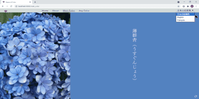
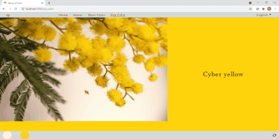

# Name-of-Color 色の名前

【English below】

<h2 align="center">色の名前</h2>
<h3 align="center">白磁、夜の青、ほろ苦い煌めき...  実はどれも色の名前。  
画像の中にかくれた色の名前が見つけられます。</h3>

---

## 機能

-   画像中の色について、日本の伝統色としての名前、英語名、フランス語名が分かります。

 

## サイト

https://name-of-color-2021aug.herokuapp.com/

 

## 使いかた

アプリを使用中いつでも「日本の伝統色」「English」「French」の間で、言語／パレットを切り替えることができます。

- 使い方　その1　 
 "Main Color"ページに行く。→ デバイス中の画像を選ぶ。→ 表示された画像をクリックすると一番使われている色の名前が分かる。

- 使い方　その2.  "Any Color"ぺージに行く。→ デバイス中の画像を選ぶ。→ 画像中の好きな箇所をクリックするとその色の名前が分かる。→ 何箇所でもクリックでき、最後にクリックした５色は画面下部に色見本が表示されて、マウスオーバーすると名前が表示される。

 

## 仕組み

"Main Color"ページでは color-thief という JavaScript ライブラリによって一番使われている色の RGB 値が、また、"Any Color"ページでは HTML の canvas 要素によってクリックした箇所の色の RGB 値が補足され、サーバー側に送られる。サーバー側で、パレット（色と RGB 値のリスト）中、送られてきた RGB 値に一番近い色が求められ、フロントエンドに戻される。

各パレットは色数、色の種類が異なるため、それぞれに「一番近い色」も同じではありません。

 

## 使用した技術

JavaScript, React, Redux, HTML5, CSS3, styled-components, Node.js, Express

 

## 今後の機能拡張

モバイルでも使えるようレスポンシブ対応。

 

## 開発の背景

もともとは日本の伝統色の持つ、美しい名前に魅せられて作成され、その後、英語、フランス語の色名も追加。

 

## 謝辞

このアプリは以下の素材、データを使って作成されました。この場を借りてお礼を申し上げます。

-   背景写真 | by Lee Jeffs on Unsplash 
-   ロゴ | by Freepik from www.flaticon.com 
-   日本の伝統色 | http://minagi.p-kit.com/page74767.html 
-   英語の色名 | https://en.wikipedia.org/wiki/* List_of_colors 
-   フランス語の色名 | https://fr.wikipedia.org/wiki/Liste_de_noms_de_couleur

 

---

<h2 align="center">Name-of-Color</h2> 
<h3 align="center">White porcelain, Blue nuit, Bittersweet shimmer...  These are all names of colors.  
Find out enchanting terms of colors in your images with Name-of-Color !</h3>

---

## Features

-   Looks up the name of the most used color in an image
-   Looks up the name of any color the user selects in an image
-   Returns names of colors in English, French, or as traditional Japanese colors -- colors used in Japanese traditional arts and crafts.

 

## Site

https://name-of-color-2021aug.herokuapp.com/

 

## Usage

You can switch between languages/palettes among "traditional Japanese colors," "English," or "French" on the select menu at any time during the use of the app.

Usage No. 1 
1. Go to the "Main Color" page
2. Select an image from your device
3. Click on the image to get the name of the most used color in the image.

Usage No.2 
1. Go to the "Any Color" page
2. Select an image from your device
3. Click on any part of the image to get the name of the color of the location you clicked.
4. You can continue to click on other parts of the image to get more names.
5. The app displays up to five last clicked colors at the bottom of the screen. You can see the names of the colors by hovering the mouse over them.

 

## How it works

On the Main Color page, the app uses a JavaScript library, color-thief, to get the RGB value of the most used color in an image. On the Any Color page, the app uses the HTML canvas element to capture the RGB value of the pixel the mouse clicked on.

In both cases, the app sends the captured RGB value to the backend, where the app determines the closest color in the selected palette (i.e., a list of color names with RGB values) and returns it to the front end with its name and RGB value. The app does not send any image to the server-side.

The "closest color" is different depending on the palette, as the colors included in the palettes are not identical.

 

## Technologies used

JavaScript, React, Redux, HTML5, CSS3, styled-components, Node.js, Express

 

## Future features

Adopt a responsive design for mobile devices

 

## Background of development

This app was created out of admiration for the beautiful names of colors in different languages.

 

## Credits

-   Landing page background photograph by Lee Jeffs on Unsplash 
-   Logo made by Freepik from www.flaticon.com 
-   Japanese traditional colors | http://minagi.p-kit.com/page74767.html 
-   English color names | https://en.wikipedia.org/wiki/* List_of_colors 
-   French color names | https://fr.wikipedia.org/wiki/Liste_de_noms_de_couleur
